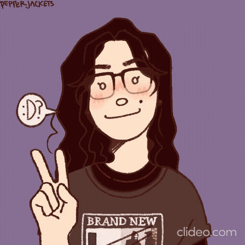

  <h2 align="center">    Oioi! Meu nome é Yasmin Shimizu :))  </h2>
  <h4 align="center"> Bem-vinde ao meu GitHub! Aqui você encontra projetos desenvolvidos ao longo da minha graduação - sejam coletivos ou individuais -, e alguns projetos independentes à título de curiosidade 😁
  </a> 

  🔭 Ciência, Tecnologia e Inovação | Ilum Escola de Ciência | CNPEM 
  ⚡ Matemática Computacional - Fuzzy | <i>Machine Learning & Deep Learning</i> - Processamento de Imagens 
  <!-- ⚡ Matemática e Lógica Fuzzy | Processamento de Imagens  -->
  🌱 <b><i>Python</i></b>

 

  

 

 

##

  

 
  
  
  
  
<!---   -->
  

 

  
  <!--   -->
  
  
  <!---  -->
  

